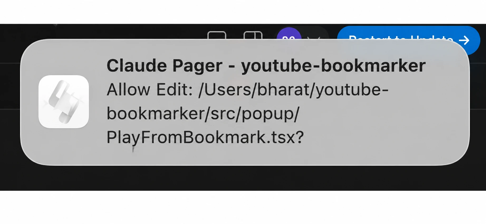
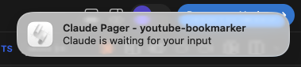
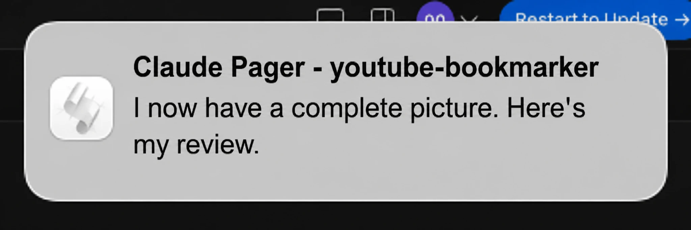
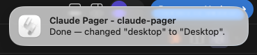

<h1 align="center"> Claude Pager</h1>

<p align="center">Native desktop notifications for Claude Code. Get alerted when a session needs your attention — permission prompts, idle waits, or task completion.</p>

## Install

```bash
git clone https://github.com/bharat7gupta/claude-pager.git
claude --plugin-dir ./claude-pager
```

## What It Does

Each notification shows your **project name** in the title so you know which session to switch to.

### Permission — Claude needs tool approval



### Idle — Claude is waiting for your input



### Task Completion — Claude finished working





## Configuration

After install, configure via `pluginConfigs` in `~/.claude/settings.json`:

```json
{
  "pluginConfigs": {
    "claude-pager": {
      "options": {
        "idle_enabled": "on",
        "permission_enabled": "on",
        "completion_enabled": "on",
        "idle_sound": "default",
        "permission_sound": "default",
        "completion_sound": "default"
      }
    }
  }
}
```

### Toggle Events

Set any `*_enabled` to `"off"` to disable that notification type.

### Sound Presets

| Preset | Description |
|---|---|
| `default` | Per-event default (idle=blow, permission=funk, completion=glass) |
| `blow` | Warm, noticeable |
| `funk` | Short, attention-grabbing |
| `glass` | Satisfying ding |
| `ping` | Subtle ping |
| `pop` | Quick pop |
| `hero` | Bold alert |
| `none` | Silent — visual notification only |

## Platform Support

| Platform | Notification | Sound | Notes |
|---|---|---|---|
| **macOS** | `terminal-notifier` or `osascript` | `afplay` | Works out of the box. `brew install terminal-notifier` for clickable notifications |
| **Linux** | `notify-send` | `paplay` / `aplay` | Requires `libnotify` package |
| **Windows** | PowerShell NotifyIcon balloon | PowerShell SystemSounds | Optional: install `BurntToast` module for modern toasts |

### Headless / SSH

When no desktop is available, falls back to a stdout line + terminal bell. No errors.

## Requirements

- Claude Code v2.1.0+
- Node.js (ships with Claude Code)
- Linux: `libnotify` / `notify-send` for desktop notifications

## License

MIT
